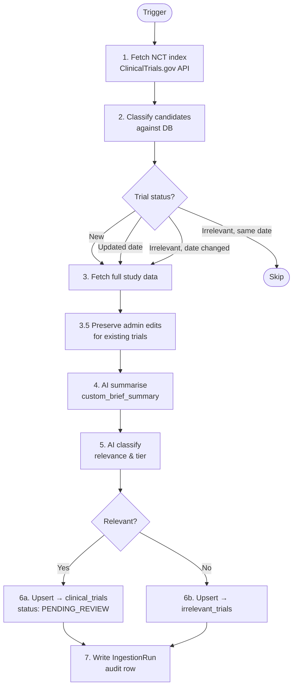
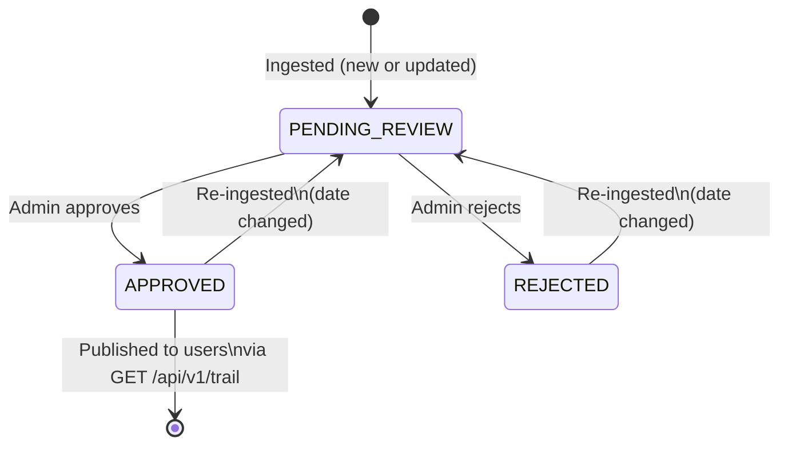

# Ingestion Pipeline

The ingestion pipeline discovers osteosarcoma-related clinical trials on ClinicalTrials.gov, generates patient-friendly AI summaries, classifies relevance, and queues trials for human review before publication.

---

## Triggers

| Method | Detail |
|--------|--------|
| **Scheduled** | APScheduler interval job, every `INGESTION_SCHEDULE_HOURS` hours (default: 24). Registered at app startup in `app/main.py`. |
| **Manual** | `POST /api/v1/debug/run-ingestion` — for testing or on-demand runs. |

---

## Pipeline Overview

---

## Step-by-Step Breakdown

### Step 1 — Fetch NCT index

**File:** [app/services/ctgov/study_index.py](../app/services/ctgov/study_index.py)

Paginates the ClinicalTrials.gov v2 API using `SEARCH_TERMS` (default: `["osteosarcoma"]`). Collects `nct_id` and `last_update_posted_date` for every matching trial. Returns a dict `{nct_id: date}`.

- Endpoint: `GET https://clinicaltrials.gov/api/v2/studies`
- Page size: `PAGE_SIZE` (default: 100)
- No auth required

---

### Step 2 — Classify candidates

**File:** [app/services/ingestion.py](../app/services/ingestion.py)

Compares the index against the database to bucket each NCT ID:

| Bucket | Condition |
|--------|-----------|
| `new_trials` | Not in `clinical_trials` or `irrelevant_trials` |
| `updated_trials` | In `clinical_trials`, but `last_update_post_date` changed |
| `reeval_trials` | In `irrelevant_trials`, but `last_update_post_date` changed |
| skipped | In `irrelevant_trials`, date unchanged |

Only trials in the first three buckets proceed to Step 3.

---

### Step 3 — Fetch full study data

**File:** [app/services/ctgov/study_detail.py](../app/services/ctgov/study_detail.py)

Fetches the complete study record for each candidate and maps it to a flat dict matching the `ClinicalTrialBase` schema. Key fields extracted: title, summary, status, phase, eligibility, interventions, locations, contacts.

- Endpoint: `GET https://clinicaltrials.gov/api/v2/studies/{nct_id}`
- Timeout: 30 s
- Failures: logged, trial skipped (`fetch_errors++`)

---

### Step 3.5 — Preserve admin edits

**File:** [app/services/ingestion.py](../app/services/ingestion.py)

For trials already in the database (updated or re-evaluated), loads any non-null `custom_*` fields that an admin has manually edited. These values are re-applied after Steps 4–5 so AI output never overwrites human curation.

---

### Step 4 — AI summarise

**File:** [app/services/ai/summarizer.py](../app/services/ai/summarizer.py)

Calls OpenAI to generate `custom_brief_summary` — a 2–3 sentence plain-language description at an 8th-grade reading level.

- Model: `AI_MODEL` (default: `gpt-4o-mini`)
- Temperature: 0.3
- Retries: 2 (3 attempts total)
- Failure: field left `None`; pipeline continues

---

### Step 5 — AI classify

**File:** [app/services/ai/classifier.py](../app/services/ai/classifier.py)

Classifies whether the trial is relevant to osteosarcoma patients and assigns a tier:

| Tier | Meaning |
|------|---------|
| `primary` | Osteosarcoma explicitly named |
| `secondary` | Broader trial (bone sarcoma, solid tumor, pediatric) where osteosarcoma patients are eligible |
| `irrelevant` | No osteosarcoma connection |

**Fail-safe:** if confidence < `CONFIDENCE_THRESHOLD` (default: 0.7) and the model says irrelevant, the trial is forced to `secondary` with reason "Low confidence — included for human review". Missing a relevant trial is worse than a false positive.

- Temperature: 0.1
- Retries: 2
- Exception: defaults to `is_relevant=True, confidence=0.0`

---

### Step 6 — Database upsert

**File:** [app/services/ingestion.py](../app/services/ingestion.py)

| Outcome | Action |
|---------|--------|
| Relevant | `session.merge()` into `clinical_trials` with `status=PENDING_REVIEW`. If trial was in `irrelevant_trials`, that row is deleted. |
| Irrelevant | `session.merge()` into `irrelevant_trials`. If trial was in `clinical_trials`, that row is deleted. |
| Previously approved | Approval preserved as `previous_approved_at` / `previous_approved_by`; status reset to `PENDING_REVIEW` for re-review. |

---

### Step 7 — Log ingestion run

**File:** [app/services/ingestion.py](../app/services/ingestion.py)

Writes one row to `ingestion_runs` with counts for every outcome and error, plus the search terms used. Provides a full audit trail of every pipeline execution.

---

## Trial Lifecycle

---

## Database Tables

| Table | Purpose |
|-------|---------|
| `clinical_trials` | Relevant trials awaiting or past human review |
| `irrelevant_trials` | Trials classified irrelevant; kept for deduplication |
| `ingestion_runs` | Audit log — one row per pipeline execution |

Schema: [app/db/models.py](../app/db/models.py)

---

## Error Handling

| Step | Failure | Behaviour |
|------|---------|-----------|
| 1 — Fetch index | API/network error | Ingestion aborted |
| 3 — Fetch study | HTTP error or timeout | Trial skipped; `fetch_errors++` |
| 4 — AI summarise | LLM error after retries | `custom_brief_summary = None`; pipeline continues |
| 5 — AI classify | LLM error after retries | Defaults to `is_relevant=True`, `confidence=0.0`; logged as `classify_errors` |
| 6 — DB upsert | SQL error | Exception propagates; run aborted |

---

## Configuration

| Env var | Default | Effect |
|---------|---------|--------|
| `SEARCH_TERMS` | `["osteosarcoma"]` | JSON list of CT.gov search terms |
| `INGESTION_SCHEDULE_HOURS` | `24` | How often the scheduler fires |
| `AI_MODEL` | `openai/gpt-4o-mini` | OpenRouter model for summarisation and classification |
| `CONFIDENCE_THRESHOLD` | `0.7` | Min confidence below which irrelevant → forced secondary |
| `PAGE_SIZE` | `100` | Results per CT.gov API page |
| `OPENROUTER_API_KEY` | — | Required; app fails to start if missing |
