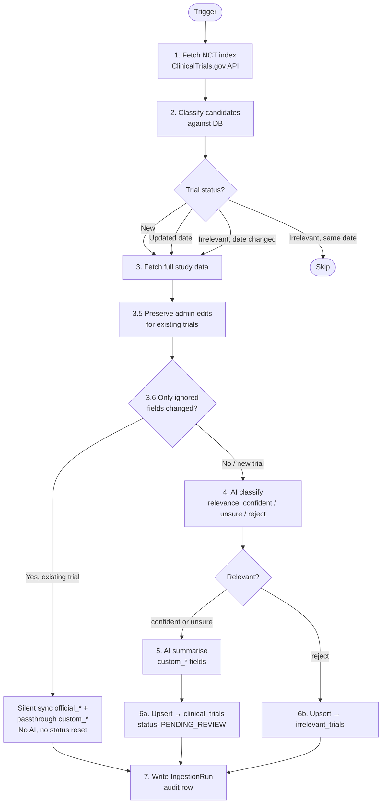
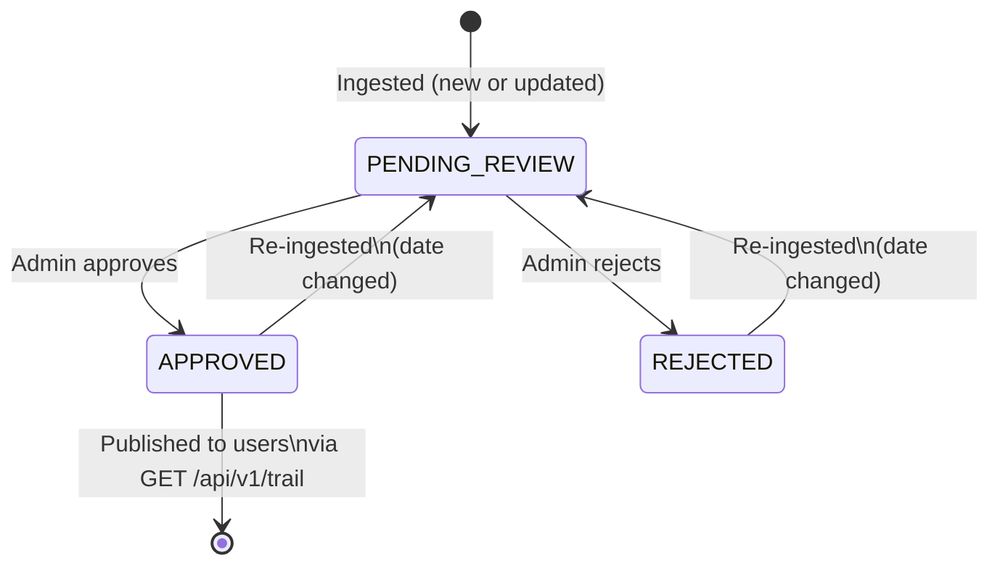

# Ingestion Pipeline

The ingestion pipeline discovers osteosarcoma-related clinical trials on ClinicalTrials.gov, generates patient-friendly AI summaries, classifies relevance, and queues trials for human review before publication.

---

## Triggers

| Method | Detail |
|--------|--------|
| **Scheduled** | APScheduler interval job, every `INGESTION_SCHEDULE_HOURS` hours (default: 24). Registered at app startup in `app/main.py`. |
| **Manual** | `POST /api/v1/debug/run-ingestion` — for testing or on-demand runs. |

---

## Pipeline Overview

```mermaid
flowchart TD
    A([Trigger]) --> B[1. Fetch NCT index\nClinicalTrials.gov API]
    B --> C[2. Classify candidates\nagainst DB]
    C --> D{Trial status?}

    D -->|New| E[3. Fetch full study data]
    D -->|Updated date| E
    D -->|Irrelevant, date changed| E
    D -->|Irrelevant, same date| Z([Skip])

    E --> F[3.5 Preserve admin edits\nfor existing trials]
    F --> M{3.6 Only ignored\nfields changed?}
    M -->|Yes, existing trial| N[Silent sync official_* +\npassthrough custom_*\nNo AI, no status reset]
    M -->|No / new trial| G[4. AI classify\nrelevance: confident / unsure / reject]
    N --> L
    G --> I{Relevant?}

    I -->|confident or unsure| H[5. AI summarise\ncustom_* fields]
    I -->|reject| K[6b. Upsert → irrelevant_trials]

    H --> J[6a. Upsert → clinical_trials\nstatus: PENDING_REVIEW]

    J --> L[7. Write IngestionRun\naudit row]
    K --> L
```

---

## Step-by-Step Breakdown

### Step 1 — Fetch NCT index

**File:** [app/services/ctgov/study_index.py](../app/services/ctgov/study_index.py)

Paginates the ClinicalTrials.gov v2 API using `SEARCH_TERMS` (default: `["osteosarcoma"]`). Collects `nct_id` and `last_update_posted_date` for every matching trial. Returns a dict `{nct_id: date}`.

- Endpoint: `GET https://clinicaltrials.gov/api/v2/studies`
- Page size: `PAGE_SIZE` (default: 100)
- No auth required

---

### Step 2 — Classify candidates

**File:** [app/services/ingestion.py](../app/services/ingestion.py)

Compares the index against the database to bucket each NCT ID:

| Bucket | Condition |
|--------|-----------|
| `new_trials` | Not in `clinical_trials` or `irrelevant_trials` |
| `updated_trials` | In `clinical_trials`, but `last_update_post_date` changed |
| `reeval_trials` | In `irrelevant_trials`, but `last_update_post_date` changed |
| skipped | In `irrelevant_trials`, date unchanged |

Only trials in the first three buckets proceed to Step 3.

---

### Step 3 — Fetch full study data

**File:** [app/services/ctgov/study_detail.py](../app/services/ctgov/study_detail.py)

Fetches the complete study record for each candidate and maps it to a flat dict matching the `ClinicalTrialBase` schema. Key fields extracted: title, summary, status, phase, eligibility, interventions, locations, contacts.

- Endpoint: `GET https://clinicaltrials.gov/api/v2/studies/{nct_id}`
- Timeout: 30 s
- Failures: logged, trial skipped (`fetch_errors++`)

---

### Step 3.5 — Preserve admin edits

**File:** [app/services/ingestion_skip.py](../app/services/ingestion_skip.py) — `load_existing_trial_state()`

For trials already in the database (updated or re-evaluated), loads any non-null `custom_*` fields that an admin has manually edited, plus a snapshot of the current row. The `custom_*` values are re-applied after Steps 4–5 so AI output never overwrites human curation. The snapshot feeds the Step 3.6 content-comparison.

Returns an `ExistingTrialState` dataclass with three maps keyed by `nct_id`:

| Map | Contents |
|-----|----------|
| `custom_map` | Non-null admin-edited `custom_*` values |
| `snapshot_map` | Current `official_*` field values (for comparison) |
| `approval_map` | `approved_at` / `approved_by` (for previously approved trials) |

---

### Step 3.6 — Skip unchanged content

**File:** [app/services/ingestion_skip.py](../app/services/ingestion_skip.py) — `skip_unchanged_trials()`, `is_content_unchanged()`, `build_sync_values()`

The pipeline detects "an update" purely by a changed `last_update_post_date`. But ClinicalTrials.gov frequently bumps that date for administrative touches (contact-info edits, location adjustments) that change nothing about relevance or summary content. Re-running the AI on these is wasted cost.

For every UPDATED clinical trial and re-evaluated irrelevant trial, `is_content_unchanged(new, snapshot, settings.IGNORED_UPDATE_FIELDS)` compares the fresh payload against the Step 3.5 snapshot. It returns `True` only when **every** non-ignored field is identical (the snapshot defines the comparison universe; fields only in `new` are not considered).

When content is unchanged, the trial is **dropped from the AI pipeline** and instead silently synced in place:

- **Official fields** — every source-backed canonical column is overwritten with the freshly-fetched value.
- **`custom_*` mirrors** — for each ignored field that has a `custom_*` mirror column, the mirror is synced **only when the admin hasn't edited it**. "Not edited" = the stored custom value is `None` or still equals the previous official snapshot (a passthrough). This prevents stale public-facing data without clobbering admin overrides.
- **No AI call, no status reset** — `classify_trial` and `ai_generate_summaries` are never invoked; an APPROVED trial stays APPROVED, an irrelevant trial stays irrelevant.

Each skipped trial increments `IngestionRun.skipped_unchanged` (Step 7). Ignored fields are configured via `IGNORED_UPDATE_FIELDS` (see Configuration).

Returns an `UnchangedSkipResult` dataclass with `clinical_skipped`, `rejected_skipped`, and `remaining_fetched` (trials that still need AI processing).

---

### Step 4 — AI classify

**File:** [app/services/ai/classifier.py](../app/services/ai/classifier.py)

Classifies whether the trial is relevant to osteosarcoma patients:

| Label | Meaning |
|-------|---------|
| `confident` | Clearly relevant — proceeds to summarisation and review queue |
| `unsure` | Possibly relevant — proceeds to summarisation and review queue |
| `reject` | No osteosarcoma connection — written directly to `irrelevant_trials`, no summary generated |

**Fail-safe:** classification errors default to `unsure` so the trial is included for manual review.

- Temperature: 0.1
- Retries: 2

---

### Step 5 — AI summarise (confident/unsure only)

**File:** [app/services/ai/summarizer.py](../app/services/ai/summarizer.py)

Only runs for trials that passed classification as `confident` or `unsure`. Generates patient-friendly `custom_*` fields at an 8th-grade reading level. Rejected trials skip this step entirely.

- Model: `AI_MODEL` (default: `gpt-4o-mini`)
- Temperature: 0.3
- Retries: 2 (3 attempts total)
- Failure: field left `None`; pipeline continues

---

### Step 6 — Database upsert

**File:** [app/services/ingestion.py](../app/services/ingestion.py)

| Outcome | Action |
|---------|--------|
| Relevant | `session.merge()` into `clinical_trials` with `status=PENDING_REVIEW`. If trial was in `irrelevant_trials`, that row is deleted. |
| Irrelevant | `session.merge()` into `irrelevant_trials`. If trial was in `clinical_trials`, that row is deleted. |
| Previously approved | Approval preserved as `previous_approved_at` / `previous_approved_by`; status reset to `PENDING_REVIEW` for re-review. |

---

### Step 7 — Log ingestion run

**File:** [app/services/ingestion.py](../app/services/ingestion.py)

Writes one row to `ingestion_runs` with counts for every outcome and error, plus the search terms used. Includes `skipped_unchanged` — the number of trials short-circuited by Step 3.6. Provides a full audit trail of every pipeline execution.

---

## Trial Lifecycle

```mermaid
stateDiagram-v2
    [*] --> PENDING_REVIEW: Ingested (new or updated)

    PENDING_REVIEW --> APPROVED: Admin approves
    PENDING_REVIEW --> REJECTED: Admin rejects

    APPROVED --> PENDING_REVIEW: Re-ingested\n(date changed)
    REJECTED --> PENDING_REVIEW: Re-ingested\n(date changed)

    APPROVED --> [*]: Published to users\nvia GET /api/v1/trail
```

---

## Database Tables

| Table | Purpose |
|-------|---------|
| `clinical_trials` | Relevant trials awaiting or past human review |
| `irrelevant_trials` | Trials classified irrelevant; kept for deduplication |
| `ingestion_runs` | Audit log — one row per pipeline execution |

Schema: [app/db/models.py](../app/db/models.py)

---

## Error Handling

| Step | Failure | Behaviour |
|------|---------|-----------|
| 1 — Fetch index | API/network error | Ingestion aborted |
| 3 — Fetch study | HTTP error or timeout | Trial skipped; `fetch_errors++` |
| 4 — AI classify | LLM error after retries | Defaults to `unsure`; logged as `classify_errors` |
| 5 — AI summarise | LLM error after retries | `custom_*` fields left `None`; pipeline continues |
| 6 — DB upsert | SQL error | Exception propagates; run aborted |

---

## Configuration

| Env var | Default | Effect |
|---------|---------|--------|
| `SEARCH_TERMS` | `["osteosarcoma"]` | JSON list of CT.gov search terms |
| `INGESTION_SCHEDULE_HOURS` | `24` | How often the scheduler fires |
| `AI_MODEL` | `openai/gpt-4o-mini` | OpenRouter model for summarisation and classification |
| `CONFIDENCE_THRESHOLD` | `0.7` | Min confidence below which irrelevant → forced secondary |
| `PAGE_SIZE` | `100` | Results per CT.gov API page |
| `IGNORED_UPDATE_FIELDS` | `last_update_post_date`, `location_country`, `location_city`, `central_contact_name`, `central_contact_phone`, `central_contact_email` | Fields whose change alone triggers a Step 3.6 silent sync instead of an AI rerun. JSON list. |
| `OPENROUTER_API_KEY` | — | Required; app fails to start if missing |

---

## Module Structure

The pipeline is split across two service modules. `run_daily_ingestion()` in
`ingestion.py` is a thin orchestrator (~50 lines) that delegates each step to a
dedicated helper.

### `app/services/ingestion.py` — orchestration

| Function / type | Step | Responsibility |
|-----------------|------|----------------|
| `run_daily_ingestion()` | — | Entry point; wires all steps together |
| `_collect_candidates()` | 1 | Search ClinicalTrials.gov for NCT IDs + dates |
| `_classify_candidates()` → `CandidateBuckets` | 2 | Bucket candidates as new / updated / re-eval |
| `_fetch_trial_details()` | 3 | Fetch and map full study records |
| `_record_empty_run()` | — | Early exit when nothing to process |
| `_classify_fetched_trials()` | 4 | AI relevance classification |
| `_split_by_relevance()` | — | Split confident/unsure vs reject |
| `_summarize_trials()` | 5 | AI summarisation for relevant trials |
| `_upsert_trials()` | 6 | Merge into `clinical_trials` or `irrelevant_trials` |
| `_record_ingestion_run()` | 7 | Write `IngestionRun` audit row + log summary |

### `app/services/ingestion_skip.py` — admin-edit preservation & skip logic

| Function / type | Step | Responsibility |
|-----------------|------|----------------|
| `load_existing_trial_state()` → `ExistingTrialState` | 3.5 | Load admin-edited fields, snapshots, approval history |
| `is_content_unchanged()` | 3.6 | Pure comparison: are only ignored fields different? |
| `build_sync_values()` | 3.6 | Build column→value dict for silent sync |
| `skip_unchanged_trials()` → `UnchangedSkipResult` | 3.6 | Skip AI for unchanged trials; sync DB in place |

Constants `CUSTOM_FIELDS` and `SNAPSHOT_FIELDS` live here because they define
which columns Steps 3.5 and 3.6 operate on.

### Design notes

- **Session factory injection** — `load_existing_trial_state()` and
  `skip_unchanged_trials()` accept a `session_factory` parameter (typically
  `SessionLocal`) rather than importing it directly. This keeps the skip module
  decoupled from the orchestrator and allows tests to monkeypatch
  `app.services.ingestion.SessionLocal`.
- **Pure vs I/O helpers** — `is_content_unchanged()` and `build_sync_values()`
  are pure functions with no DB access, making them easy to unit-test in
  isolation (`tests/test_ingestion_skip.py`).
- **Dataclasses for step output** — `CandidateBuckets` (Step 2),
  `ExistingTrialState` (Step 3.5), and `UnchangedSkipResult` (Step 3.6) carry
  structured state between steps instead of loose tuples/dicts.

See also: [ingestion_refactor_changelog.md](ingestion_refactor_changelog.md) for
the full list of changes made during the modularisation refactor.
